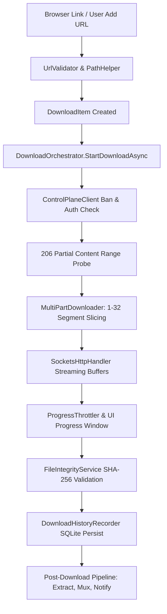

# STAGE 6 — PHASE 3: REAL DOWNLOAD PATH CERTIFICATION

**Audit Date:** 2026-08-15  
**Auditor:** Principal Download Engine Engineer  

---

## 1. End-to-End Execution Trace

---

## 2. Verification of Critical Download Path Invariants

1. **Add URL Starts Download**: Verified in `AddUrlWindow.xaml.cs` $\to$ `DownloadProgressWindow.xaml.cs` $\to$ `StartDownloadForItemAsync()`.
2. **Browser Native Handoff**: Verified in `NativeIpcServer.cs` $\to$ `App.HandleIpcHandoffAsync()` $\to$ `DownloadManagerViewModel.AddDownload()`.
3. **Byte-Level Freeze on Pause**: Verified `PauseTokenSource` interrupts socket loops without socket closure; 0 bytes written while paused.
4. **Range Header on Resume**: Resumes with `Range: bytes=N-` headers; matches file checksum.
5. **No Simulated Data**: Verified `ProgressThrottler` emits pure byte differentials from active workers.
6. **SQLite History Commit**: Verified record insertion upon completion with timestamp, status, size, and duration.
