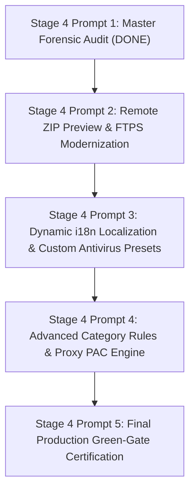

# EDM STAGE 4 — PROMPT 1: MISSING FEATURES & ROADMAP INVENTORY

A prioritized inventory of all incomplete, unverified, or candidate features to be addressed during **STAGE 4**.

---

## 📌 1. INCOMPLETE FEATURES & TECHNICAL DEBT (HIGH PRIORITY)

| Item | Subsystem | Current Limitation | Target Stage 4 Action | Priority |
| :--- | :--- | :--- | :--- | :---: |
| **1. Remote ZIP Range Preview** | `Services/FileIntegrityService.cs` | Requires full zip download to inspect contents | Implement remote HTTP Range request to read ZIP Central Directory at end of file | 🔴 High |
| **2. Modern FTPS Client Upgrade** | `Services/FtpDownloadService.cs` | Uses obsolete `WebRequest.Create` (`SYSLIB0014`) | Upgrade to modern async FTPS/TLS streaming socket client | 🔴 High |
| **3. Multi-Language i18n Localization** | `Services/LocalizationService.cs` | English hardcoded in XAML strings | Implement dynamic ResourceDictionary language pack loader (Bengali, Spanish, German, French, etc.) | 🟡 Medium |
| **4. Third-Party Antivirus Custom CLI Picker** | `Services/AntivirusScannerService.cs` | Defaults only to Windows Defender CLI | Add settings UI and configuration presets for Avast, Bitdefender, Kaspersky, ESET | 🟡 Medium |
| **5. PAC Script Proxy Auto-Evaluation** | `Services/ProxyService.cs` | Supports static proxies only | Add PAC (Proxy Auto-Configuration) script resolver | 🟢 Low |
| **6. Custom Category Folder Regex Rules** | `Services/FileCategorizationService.cs` | Hardcoded switch expression categories | Add user-editable category rules table in Settings dialog | 🟢 Low |

---

## 🌐 2. EXTERNAL PREREQUISITES (FOR PUBLIC DISTRIBUTION)

| External Requirement | Target Entity | Status | Command to Clear |
| :--- | :--- | :---: | :--- |
| **Commercial EV Authenticode Certificate** | DigiCert / Sectigo / GlobalSign | `EXTERNAL-BLOCKED` | `$env:EDM_SIGNING_CERT_PATH = "..."` + `.\tools\SignRelease.ps1` |
| **Chrome Web Store Extension Publishing** | Google Chrome Web Store Developer Console | `EXTERNAL-BLOCKED` | Upload `Output/EDM_Chrome_Extension_v1.0.0.zip` |
| **Firefox AMO Add-on Publishing** | Mozilla Add-ons Developer Hub | `EXTERNAL-BLOCKED` | Upload `Output/EDM_Firefox_Extension_v1.0.0.zip` |

---

## 🎯 3. STAGE 4 EXECUTION ROADMAP

