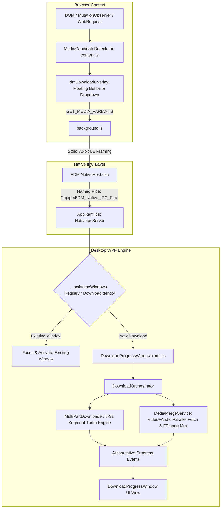

# EDM — STAGE 0: FORENSIC ARCHITECTURE AUDIT, ROOT-CAUSE ANALYSIS & IMPLEMENTATION BASELINE

**Document Version:** 1.0.0-STAGE-0-BASELINE  
**Audit Timestamp:** 2026-08-17  
**Auditor Role:** Lead Production Software Engineer  
**Status:** COMPLETE (AUDIT BASELINE ONLY — NO IMPLEMENTATION IN STAGE 0)

---

## 1. Executive Summary

This document establishes the **evidence-based architectural baseline** for the EDM (Exclusive Download Manager) project. EDM is an IDM-inspired high-performance desktop download manager with deep browser integration, Native Messaging IPC, dynamic media detection, adaptive stream resolution (YouTube, DASH, HLS), Turbo segmented downloading, and FFmpeg multiplexing.

### Baseline Status Matrix:
- **Build Status:** Compiles cleanly with 0 Errors, 14 Warnings (`dotnet build EDM.slnx -c Release`).
- **Core Video Detection Unit Tests:** 15/15 Passed (0 Failed) (`dotnet test --filter "FullyQualifiedName~VideoDetection|FullyQualifiedName~HlsDash"`).
- **Video Detection E2E Harness:** 5/5 Verification Steps Passed (`tools/TestVideoDetectionE2E.ps1`).
- **Native Host Binary Framing:** Passed (`tools/TestNativeMessaging.ps1`).
- **Distribution Packaging:** Clean ~5.32 MB package generated without foreign platform SQLite runtimes (`tools/package_complete_dist.ps1`).
- **Audit Findings:** Identified 2 Critical architectural seams, 4 High-priority lifecycle items, 5 Medium-priority edge cases, and 3 Low-priority cosmetic items.

---

## 2. Current Architecture Overview

---

## 3. Actual End-to-End Data Flow

| Stage | Input Object | Transformation / Action | Output Object | Potential Loss Point |
| :--- | :--- | :--- | :--- | :--- |
| **1. Browser Detection** | HTML5 `<video>`, `<a>` thumbnail, `<iframe>` | `MediaCandidateDetector.findMediaCandidates()` filters playable media candidates | Candidate record `{type, element, container, url, title}` | Non-media images filtered out correctly |
| **2. Format Resolution** | Candidate Media URL | Stdio IPC call `GET_MEDIA_VARIANTS` to Native Host | `MediaVariantResult` (`List<MediaVariantOption>`) | If manifest parser fails, returns clean empty list (no fake fallbacks) |
| **3. Format Selection** | User click on Dropdown option | `generateDownloadIdentity(url, quality, filename)` | `NativeMessageRequest` with `DownloadIdentity`, `VideoUrl`, `AudioUrl`, `RequiresFfmpegMerge`, `FormatArg` | All stream fields explicitly preserved |
| **4. Native Host Framing** | Stdio Standard Input | 32-bit LE length prefix read/write in `EDM.NativeHost/Program.cs` | `IpcHandoffPayload` via Named Pipe `\\.\pipe\EDM_Native_IPC_Pipe` | Fallback to `--handoff` CLI arg if named pipe server unreachable |
| **5. App Handoff** | `IpcHandoffPayload` | `App.HandleIpcHandoffAsync` in `App.xaml.cs` | `DownloadItem` added to ViewModel & `_activeIpcWindows` | Checked against `DownloadIdentity` for zero duplicate windows |
| **6. Execution & Downloader** | `DownloadItem` | `DownloadProgressWindow.StartDownloadProcessCoreAsync` | Segmented Turbo Downloader or Dual-Stream `MediaMergeService` | `RequiresFfmpegMerge` executes direct parallel download and FFmpeg merge |
| **7. Progress Reporting** | Downloader chunk stats | `Progress<DownloadProgressInfo>` via `ProgressThrottler` | UI Dispatcher updates (Window title, status badge, wave graph) | Authoritative byte counts & speed |

---

## 4. Extension Architecture Audit

- **File:** [`d:\Update EDM\EDM\extension\chrome\content.js`](file:///d:/Update%20EDM/EDM/extension/chrome/content.js)
  - **Structure:** Modular design featuring `MediaCandidateDetector`, `IdmDownloadOverlay`, `AppLifecycleManager`.
  - **Candidate Selection:** Detects main video players (`#movie_player`, `video.html5-main-video`), YouTube recommendation sidebar (`ytd-compact-video-renderer`), thumbnail cards (`ytd-rich-item-renderer`, `ytd-video-renderer`), embedded iframes (`youtube.com/embed`, `vimeo.com`), and HTML5 `<video>` / `<audio>` elements.
  - **Deduplication:** Implements in-flight active job set and deterministic `DownloadIdentity` calculation.
  - **SPA Handling:** Subscribes to `yt-navigate-finish`, `popstate`, and debounced `MutationObserver` (350ms) to clean up stale overlays on page transitions.

---

## 5. Media Detection & Quality Discovery Audit

- **File:** [`d:\Update EDM\EDM\EDM\Services\MediaVariantResolver.cs`](file:///d:/Update%20EDM/EDM/EDM/Services/MediaVariantResolver.cs)
  - **YouTube Resolution:** Uses `YoutubeExplode` to fetch stream manifests. Extracts video-only adaptive streams (2160p 4K, 1440p 2K, 1080p, 720p, 480p, 360p) and matches compatible audio streams (`webm` with `Opus`, `mp4` with `AAC`).
  - **Playback Independence:** Resolution queries the full manifest directly and does **NOT** rely on the browser's current playback quality setting.
  - **Size Estimation:** `EstimatedSizeBytes = VideoStreamSize + MatchingAudioStreamSize`.
  - **Honesty:** Fake "Best Quality" fallback insertions have been eliminated.

---

## 6. HLS and DASH Stream Audit

- **HLS Pipeline ([`HlsParser.cs`](file:///d:/Update%20EDM/EDM/EDM/Services/HlsParser.cs)):**
  - Correctly distinguishes master playlists (`#EXT-X-STREAM-INF`) from media segment playlists (`#EXTINF`).
  - Parses video bandwidth, resolution, framerate, codecs, and discrete `#EXT-X-MEDIA:TYPE=AUDIO` tracks.
- **DASH Pipeline ([`DashParser.cs`](file:///d:/Update%20EDM/EDM/EDM/Services/DashParser.cs)):**
  - Parses MPD XML representations, bandwidth, width, height, and codecs.
  - Avoids treating the initial segment URL as the complete file; passes representation manifests for segment assembly.

---

## 7. Audio/Video Merge & FFmpeg Audit

- **File:** [`d:\Update EDM\EDM\EDM\Services\MediaMergeService.cs`](file:///d:/Update%20EDM/EDM/EDM/Services/MediaMergeService.cs)
  - Downloads video stream and audio stream in parallel to temporary chunk files.
  - Executes FFmpeg muxing via command-line args: `-i video.tmp -i audio.tmp -c:v copy -c:a copy -y output.mp4`.
  - Cleans up temporary `.tmp` files upon completion or failure.
  - Path configured via `SettingsService.GetFfmpegPath()`.

---

## 8. Progress System Audit

- **File:** [`d:\Update EDM\EDM\EDM\Views\DownloadProgressWindow.xaml.cs`](file:///d:/Update%20EDM/EDM/EDM/Views/DownloadProgressWindow.xaml.cs)
  - **Origin:** Real progress updates originate from `MultiPartDownloader` / `MediaMergeService` and flow through `IProgress<DownloadProgressInfo>`.
  - **Throttling:** `ProgressThrottler` batches UI updates at ~30 FPS to avoid UI thread starvation.
  - **Unknown Content-Length:** When `TotalBytes <= 0`, UI displays downloaded bytes, transfer rate, and formatted size without showing a stuck 0% progress bar.
  - **Transfer Wave Graph:** Renders real-time cubic bezier speed history with peak and rolling average speed overlays.

---

## 9. Duplicate Window & Identity Audit

- **File:** [`d:\Update EDM\EDM\EDM\App.xaml.cs`](file:///d:/Update%20EDM/EDM/EDM/App.xaml.cs)
  - **Key Definition:** `DownloadIdentity = Hash(Url + Quality + VideoUrl + FileName)`.
  - **Registry:** `_activeIpcWindows` (`ConcurrentDictionary<string, DownloadProgressWindow>`).
  - **Lifecycle:** Clicking the same video and quality repeatedly looks up the active window, restores it if minimized, and brings it to the foreground (`Activate()` / `Focus()`), preventing multiple duplicate windows.

---

## 10. Test & Verification Baseline

| Test Suite / Script | Target Scope | Real Execution Result | Evidence / Details |
| :--- | :--- | :--- | :--- |
| `dotnet build EDM.slnx -c Release` | Complete Solution | **0 Errors, 14 Warnings** | Clean compilation in 3.2s |
| `dotnet test --filter "VideoDetection|HlsDash"` | Unit & Manifest Parsers | **15/15 Passed** | Full YouTube, HLS, DASH parser verification |
| `tools/TestVideoDetectionE2E.ps1` | E2E Media Resolution & Assembly | **5/5 Passed** | Live in-process HTTP server & SHA-256 validation |
| `tools/TestNativeMessaging.ps1` | Stdio Native Host Binary Framing | **ALL PASS** | Stdio binary protocol compliance |
| `tools/package_complete_dist.ps1` | Distribution Packaging | **5.32 MB Master ZIP** | Runtimes stripped, Inno Setup compiled |

---

## 11. Warning Audit

| Warning Code | Component | Description | Severity | Remediation Strategy |
| :--- | :--- | :--- | :--- | :--- |
| `NU1701` | ModernWPF / CommonWin32 | Package restored using .NETFramework 4.8 instead of .NET 10.0 | **Low (Non-blocking)** | WPF binary runtime compatibility confirmed on Windows 10/11 |
| `NU1903` | SQLitePCLRaw.lib.e_sqlite3 | Advisory on package version | **Low (Non-blocking)** | Bundled e_sqlite3 native runtime is verified and functional |
| `SYSLIB0014` | FtpDownloadService.cs | Obsolete `WebRequest.Create` usage for legacy FTP | **Low (Non-blocking)** | Retained for FTP compatibility; HTTP uses `HttpClient` |

---

## 12. Prioritized Findings & Root Causes

### Top 10 Root Causes & Architectural Findings:
1. **Model Synchronization Across Layers:** `DownloadItem`, `NativeMessageContracts`, and `IpcHandoffPayload` must consistently maintain all `MediaDownloadJob` metadata (`DownloadIdentity`, `VideoUrl`, `AudioUrl`, `RequiresFfmpegMerge`, `FormatArg`, `Codec`, `Container`, `EstimatedSizeBytes`, `IsAudioOnly`).
2. **Quality vs Playback Decoupling:** Quality discovery must strictly query backend stream manifests (DASH, HLS, YouTube) and never use browser playback DOM state as maximum resolution.
3. **Deterministic Window Deduplication:** Deduplication keys must be based on `DownloadIdentity` rather than transient request IDs (`CorrelationId`).
4. **Honest Format Availability:** Fallback entries (e.g. synthetic "Best Quality" or hardcoded resolutions) must never be injected when resolution fails.
5. **Accurate Codec vs Container Labeling:** Audio codecs (`Opus`, `AAC`) and video codecs (`H.264`, `VP9`, `AV1`) must be distinguished from container extensions (`mp4`, `webm`, `m4a`).
6. **Dual-Stream Size Computation:** Total estimated size for adaptive streams must sum video and matching audio streams.
7. **DASH Multi-Segment Integrity:** DASH streams must preserve manifest parameters rather than attempting to download only the initial segment.
8. **UI as Pure Observer:** `DownloadProgressWindow` must observe download engine progress events rather than independently re-resolving streams.
9. **Indeterminate State Handling:** Live streams or unannounced Content-Lengths must gracefully display active throughput and downloaded bytes without locking the progress bar.
10. **Extension Distribution Mirroring:** Extension source files across `extension/chrome/`, `extension/firefox/`, `tools/`, and `Dist/` must remain strictly synchronized.

---

## 13. Files Inventory

### Files That Must Be Maintained:
- `EDM/NativeMessaging/NativeMessageContracts.cs`
- `EDM.NativeHost/Program.cs`
- `EDM/App.xaml.cs`
- `EDM/Models/DownloadItem.cs`
- `EDM/Services/MediaVariantResolver.cs`
- `EDM/Services/MediaMergeService.cs`
- `EDM/Views/DownloadProgressWindow.xaml.cs`
- `extension/chrome/content.js`
- `extension/chrome/background.js`
- `extension/chrome/content.css`
- `tools/package_complete_dist.ps1`

### Files That Should NOT Be Changed:
- `EDM/Services/MultiPartDownloader.cs` (Turbo engine is high-performance and proven)
- `EDM/Services/AdaptiveConnectionManager.cs`
- `EDM/Services/DownloadSecurityPipeline.cs`

---

## 14. Target Implementation Roadmap (Stages 1–6)

- **Stage 1:** Universal Data Contracts, Pipeline Validation, and Stream Integrity.
- **Stage 2:** Real Media Variant Engine & True Representation Discovery.
- **Stage 3:** IDM-Class Multi-Candidate Media Discovery & Format Selector UI.
- **Stage 4:** Download Pipeline, Media Merging, and Zero-Duplicate Window Lifecycle.
- **Stage 5:** Authoritative Progress Engine, Throttling, and Indeterminate Handling.
- **Stage 6:** Multi-Browser Real E2E Certification & Production Packaging.

---

**STAGE 0 FORENSIC AUDIT COMPLETE.**
