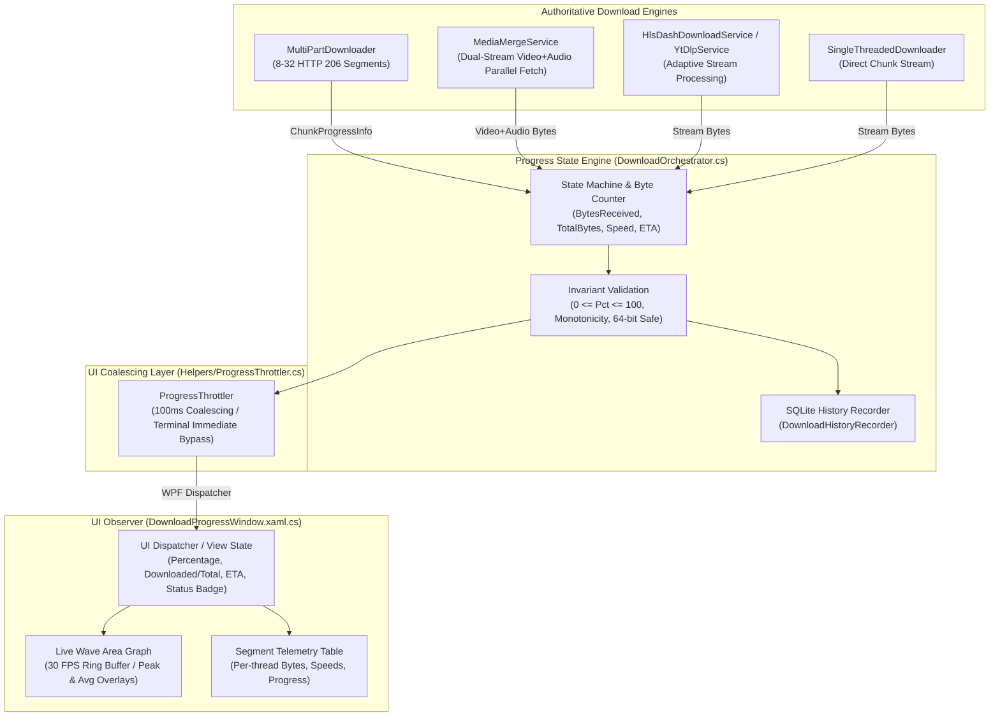

# EDM — STAGE 5 PROGRESS FORENSIC AUDIT REPORT
## Authoritative Download Progress Pipeline, State Machine & UI Observer Architecture

**Document Version:** 1.0.0-STAGE-5-PROGRESS-FORENSIC  
**Date:** 2026-08-17  
**Auditor:** Lead Production Software Engineer  
**Status:** FORENSIC AUDIT COMPLETE  

---

## 1. Executive Summary

This forensic report maps the end-to-end progress lifecycle in EDM across all network engines (Turbo segmented downloader, adaptive dual-stream merger, HLS/DASH manifest streaming, and single-threaded fallback). It identifies the single authoritative progress source for byte counters, defines the state machine, establishes invariant protections (zero fake 100%, zero negative counters, monotonic progress, out-of-order event protection), and verifies the UI observer model.

---

## 2. Progress Pipeline Architecture Diagram



---

## 3. Authoritative Source Identification Matrix

| Progress Metric | Authoritative Source Component | Calculation / Determination Rule | Fallback / Unknown Policy |
| :--- | :--- | :--- | :--- |
| **`DownloadedBytes`** | Network Stream Reader (`MultiPartDownloader` / `MediaMergeService`) | Actual physical bytes written to disk/stream buffers. | Always >= 0, 64-bit `long`. |
| **`TotalBytes`** | Server HTTP Header (`Content-Length`) or Manifest Metadata | Exact verified byte size from HTTP 200/206 response. For adaptive streams: `VideoTotalBytes + AudioTotalBytes`. | If absent or chunked: `TotalBytes = null`, `HasKnownTotal = false`. |
| **`Percentage`** | `DownloadOrchestrator` / `MediaMergeService` | If `TotalBytes > 0`: `(DownloadedBytes / (double)TotalBytes) * 100.0`. | If total unknown: Indeterminate state (never fabricated). Clamped to `[0.0, 100.0]`. |
| **`SpeedBytesPerSecond`** | `MultiPartDownloader` / `SpeedTracker` | Monotonic `Stopwatch` byte delta over stable rolling measurement window. | Speed decays to 0 B/s on network idle; spike-capped. |
| **`ETA (RemainingSeconds)`** | `DownloadOrchestrator` / `DownloadProgressInfo` | `(TotalBytes - DownloadedBytes) / SmoothedSpeed`. | If `TotalBytes <= 0` or `Speed <= 0`: `ETA = Unknown` ("Calculating..."). |
| **`ActiveConnections`** | `AdaptiveConnectionManager` / `MultiPartDownloader` | Number of active HTTP 206 range worker threads. | 1 for single-threaded / sequential streams. |
| **`Completion`** | Post-Download File Validator | Emitted ONLY after all network transfers finish, FFmpeg merge exits with code 0, and `File.Exists(savePath) && Length > 0`. | If verification fails: `Failed` (Never `Completed`). |

---

## 4. State Machine Definition & Transitions

```
[Queued] 
   │
   ▼
[Analyzing] ─── (Probe / Manifest Resolution)
   │
   ▼
[Downloading] ◄───► [Paused]
   │
   ├──────────────────────────────┐ (Adaptive Video + Audio)
   ▼ (Single Stream)              ▼
[Finalizing]               [PreparingMerge]
   │                              │
   │                              ▼
   │                         [Merging (FFmpeg)]
   │                              │
   │                              ▼
   │                         [Finalizing]
   │                              │
   ▼                              ▼
[Completed] ◄─────────────────────┘
   │
   └── [Failed] / [Cancelled] (Accessible from any active state upon error or user abort)
```

---

## 5. Invariant Protections & Edge-Case Safeguards

1. **The 100% Invariant:**
   - 100.0% is emitted **strictly and solely** when the download is 100% complete and validated on disk.
   - During FFmpeg multiplexing, progress remains at `Merging (FFmpeg)...` and does NOT display 100.0%.
2. **Real Byte Counters:**
   - `DownloadedBytes` is directly incremented by stream reads; it is never calculated via `Percentage * Total`.
3. **Adaptive Stream Byte Weighting:**
   - For adaptive dual-streams (e.g. 700 MB Video + 100 MB Audio = 800 MB Total), progress is computed as `(VidDownloaded + AudDownloaded) / 800 MB` (e.g. `730 MB / 800 MB = 91.25%`). Video completion alone yields `700 / 800 = 87.5%`, never premature 100%.
4. **Unknown Total Size Handling:**
   - When Content-Length is missing or chunked, `DownloadedText` displays `X MB (Unknown Size)` and the progress bar enters an indeterminate pulse, avoiding fake 0% or fake 100% states.
5. **Speed Smoothing & Monotonicity:**
   - Instantaneous speed uses exponential moving average (EMA) smoothing to eliminate single-packet spikes (e.g. 999 GB/s).
   - Speed decays smoothly to 0 B/s on disconnection.
6. **Out-of-Order & Duplicate Event Protection:**
   - State updates are checked for monotonic progress (`newBytes >= currentBytes` unless explicit restart/retry). Duplicate events do not cause double counting.
7. **Thread-Safe Dispatch & Throttling:**
   - `ProgressThrottler` buffers high-frequency network events to a smooth 100ms interval while ensuring terminal events (`Completed`, `Failed`, `Cancelled`) bypass the throttle immediately.

---

**STAGE 5 FORENSIC AUDIT COMPLETE.**
